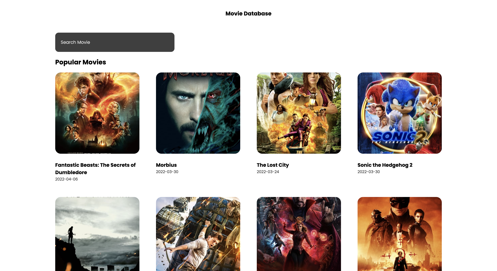

# Movie DB

A movie app using SvelteKit.

## Demo

[See Demo deployed on Netlify](https://sveltekit-moviedb.netlify.app/)

        

## Features

- setting up a SvelteKit app.
- fetching data from TMDB API.
- displaying popular movies in a grid.
- showing movie details.
- adding global styles.
- creating a layout.
- adding a search bar.
- using animations and page transitions.
- deploying to Netlify.

Based on [SvelteKit For Beginners | Movie App Tutorial](https://www.youtube.com/watch?v=ydR_M0fw9Xc) by Simo Edwin - Dev Ed (2022).