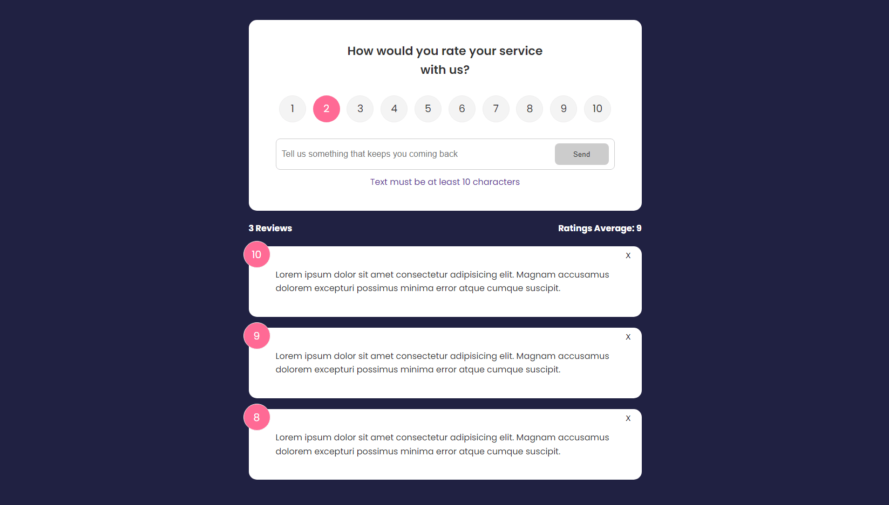
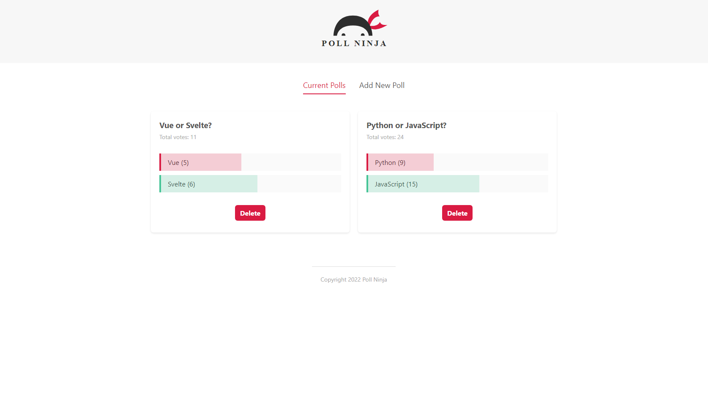
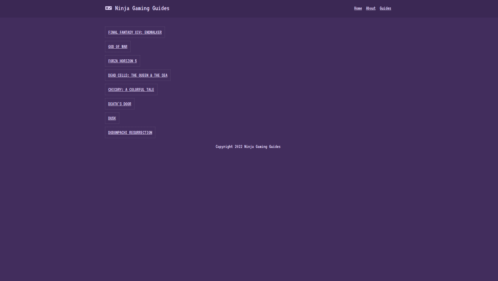

# Svelte Projects

3 small projects to understand Svelte core concepts.

| #   | Project                           | Description                                           |
| --- | --------------------------------- | ----------------------------------------------------- |
| 01  | [**Feedback App**](#feedback) | A small project to understand Svelte core concepts.               |
| 02  | [**Poll Ninja**](#poll)        | A simple app to create polls.           |
| 03  | [**Ninja Gaming Reviews**](#gaming)     | A basic website using SvelteKit.                                 |

## 1) Feedback App

A small project to understand Svelte core concepts.

[See 01-feedback-app folder](01-feedback-app)

    

### Features

- setting up a Svelte project.
- understanding reactive values, conditional rendering and data mapping.
- using components, passing props and displaying slots.
- forwarding events with createEventDispatcher.
- counting reviews and displaying ratings average with reactive values.
- handling user inputs with reactive values.
- adding transitions with svelte/transition.
- getting, adding and deleting the data from the store.
- understanding onMount and onDestroy states.

Based on [Svelte Crash Course](https://www.youtube.com/watch?v=3TVy6GdtNuQ) by Brad Traversy (2021).

## 2) Poll Ninja

A simple app to create polls.

[See 02-poll-ninja folder](02-poll-ninja)

    

### Features

- setting up a Svelte app.
- using reactive values and reactive statements.
- rendering loops, using conditionals and handling events.
- creating a layout, reusing some components and managing CSS.
- forwarding events, using event modifiers and displaying slots.
- building forms, validating user inputs and dispatching custom events.
- casting votes and displaying vote bars.
- managing polls with a store, updating store data and deleting polls.
- adding micro-interactions with svelte/transition, svelte/animate and svelte/motion.

Based on [Svelte Tutorial for Beginners](https://www.youtube.com/playlist?list=PL4cUxeGkcC9hlbrVO_2QFVqVPhlZmz7tO) by Shaun Pelling - The Net Ninja (2020).

## 3) Ninja Gaming Reviews

A basic website using SvelteKit.

[See 03-ninja-gaming-reviews folder](03-ninja-gaming-reviews)

### Demo

[See Demo deployed on Vercel](https://sveltekit-ninja-gaming.vercel.app/)

    

### Features

- setting up a SvelteKit app.
- understanding pages and routes.
- creating a global layout, resetting it and reusing components.
- fetching data with server-side and client-side renderings.
- handling dynamic routes and redirects.
- pre-fetching data and adding custom error pages.
- using API routes.
- deploying to Vercel.

Based on [SvelteKit Crash Course Tutorial](https://www.youtube.com/playlist?list=PL4cUxeGkcC9hpM9ARM59Ve3jqcb54dqiP) by Shaun Pelling - The Net Ninja (2022).
